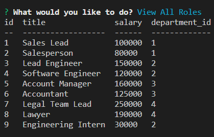
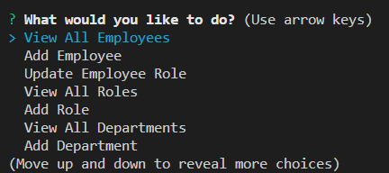

# Employee Tracker

## Description

Add and update employee data in the Employee Tracker via the command line. Review the table data that contains the department, roles, and employee information. Update the data or add new employees.

---

Link to the application:
[Employee Tracker](https://github.com/Yiladien/employee-tracker)

---

## Video walkthrough of the application: [Link](https://drive.google.com/file/d/1c_hMmYTKsF8cxVbnGzR4jG6hKbewf9kH/view)

---

## Table of Contents

- [Installation](#installation)
- [Usage](#usage)
- [Contributing](#contributing)
- [Tests](#tests)
- [Questions](#questions)

---

## Installation

Clone this repository, npm install to add dependencies.

---

## Usage

Free to use.

---

## Contributing

Just link to this repository.

---

## Tests

No tests in this version.

---

## Questions

Please contact the owner with any questions.
Email: yiladien@hotmail.com
GitHub profile: https://github.com/Yiladien

---
